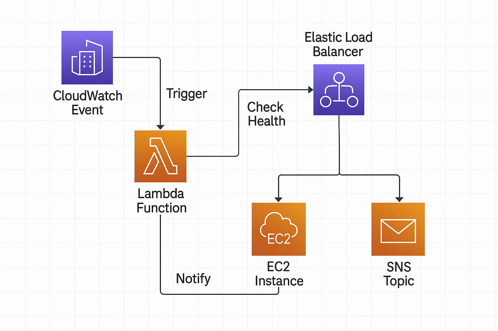

---

```markdown
# 🚦 ELB Health Checker using AWS Lambda

This project automatically checks the health of EC2 instances behind an AWS **Application Load Balancer (ALB)** every 10 minutes using an AWS **Lambda function**. If any registered instances are found to be **unhealthy**, the function sends an alert email via **Amazon SNS**.

---

## 📌 Features

- 🖥️ Monitors EC2 health via ALB Target Group
- ⏱️ Triggers every 10 minutes via CloudWatch
- 📬 Sends email notifications using SNS
- 🔐 Uses Boto3 with environment variables
- 💡 Built on AWS Free Tier

---

## 🗂️ Folder Structure

```

elb-health-checker/
│
├── lambda\_function.py         # Lambda code
├── setup\_steps.md             # AWS setup documentation
├── architecture.png           # AWS architecture diagram (optional)
├── .env.example               # Sample env variables (do NOT commit actual values)
└── README.md                  # This file

````

---

## ⚙️ Environment Variables

| Key               | Description                             |
|------------------|-----------------------------------------|
| `TARGET_GROUP_ARN` | ARN of your ALB Target Group             |
| `SNS_TOPIC_ARN`    | ARN of your SNS topic for notifications  |

Example `.env.example`:
```env
TARGET_GROUP_ARN=arn:aws:elasticloadbalancing:ap-south-1:123456789012:targetgroup/ubuntu-target-group/abc123
SNS_TOPIC_ARN=arn:aws:sns:ap-south-1:123456789012:elb-health-notify
````

---

## 🧠 Architecture



---

## 📝 Lambda Code Summary

* Uses `boto3` to call `describe_target_health()` on the Target Group
* Filters out instances not marked as `healthy`
* If any are unhealthy, sends a formatted alert to SNS
* Otherwise logs “All instances are healthy”

---

## 🛠 AWS Setup (Summary)

You can find full detailed steps in [`setup_steps.md`](./setup_steps.md), but here's a quick overview:

1. **Launch 2 Ubuntu EC2 instances** and install Apache
2. **Create Target Group** with health checks on `/`
3. **Create ALB** and register both instances
4. **Create SNS Topic** and subscribe via email
5. **Create IAM Role** with required permissions
6. **Create Lambda Function** and add the code
7. **Set Environment Variables** for Target Group ARN and SNS ARN
8. **Create CloudWatch Event Rule** to trigger Lambda every 10 minutes
9. **Test** by stopping Apache on one instance

---

## ✅ Permissions Required

Attach this IAM policy to your Lambda execution role:

* `AmazonEC2ReadOnlyAccess`
* `ElasticLoadBalancingReadOnly`
* `AmazonSNSFullAccess`

---

## 🧪 Testing

You can test it by:

```bash
sudo systemctl stop apache2
```

Then wait \~2-3 minutes. Lambda will pick up the unhealthy instance on its next 10-min run and you will receive an email from SNS.

---

## 💻 Technologies Used

* AWS Lambda
* Boto3 (Python 3.12)
* Elastic Load Balancer (ALB)
* EC2 (Ubuntu)
* SNS
* CloudWatch Events
* IAM

---

## 📬 Author

**Vignesh Sadanki**
💼 AWS | DevOps | Cloud Projects
📧 sadanki190@gmail.com

---

## 📜 License

This project is licensed under the MIT License.

